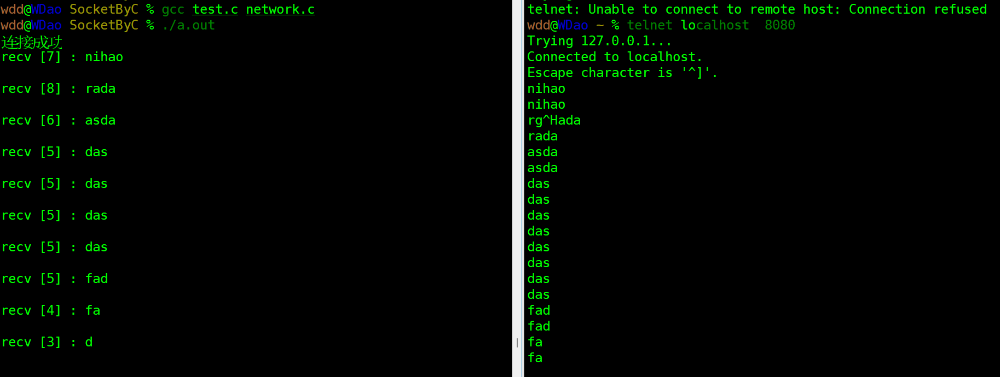

# DevLib

> 个人开发组件库

## socket网络组件

###  C语言实现socket套接字网络连接功能

- 功能实现文件

` ./Socket/SocketByC/network.h `

` ./Socket/SocketByC/network.c `

- 测试代码文件

`./Socket/SocketByC/test.c`

###  C++实现 socket套接字网络连接功能

